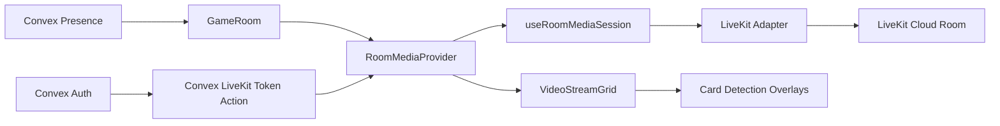

# LiveKit Cloud Implementation Plan

## Scope

Replace the current app-owned WebRTC transport with LiveKit Cloud as a hard migration. Keep Convex for room access, presence, bans/kicks, duplicate-session handling, seat count, and game state. Remove the existing P2P stack in the same implementation sequence rather than keeping a long-lived fallback path.

## Documentation Notes

Context7 docs for `livekit-client` show the browser SDK flow as:

- create `new Room({ adaptiveStream: true, dynacast: true, ... })`
- register `RoomEvent` handlers before `room.connect(url, token)`
- publish local camera/mic with `room.localParticipant.enableCameraAndMicrophone()` or explicit `publishTrack(...)`
- handle `TrackSubscribed`, `TrackUnsubscribed`, `TrackMuted`, `TrackUnmuted`, `Reconnecting`, `Reconnected`, and `Disconnected`
- attach/detach tracks with `track.attach(...)` and `track.detach()`

Context7 docs for LiveKit token generation show a backend-created token using `AccessToken`, `roomJoin`, room name, participant identity, name, metadata/attributes, and a short TTL. For this repo, token generation should live in Convex, not the client.

## Target Architecture

## Separation of Concerns

- Convex authorization lives in Convex-only modules. Token issuance should verify room/session access and return `{ serverUrl, token }`, but it should not know about React components, video tiles, or card detection.
- LiveKit SDK usage lives behind a small media transport boundary. UI components should consume app-level media state and actions, not raw `Room` objects except in narrow diagnostics or adapter code.
- Device preferences and setup UI remain separate from transport publishing. The preference store owns selected device IDs and committed setup state; the LiveKit media layer consumes those IDs and owns capture/publish behavior.
- Tile rendering remains presentation-focused. `VideoStreamGrid`, `LocalVideoCard`, and remote tile components should render participants, controls, overlays, and track elements, but should not connect rooms or issue tokens.
- Track attachment is isolated to one component/hook. Card detection can receive video element refs, but it should not care whether the underlying media came from LiveKit or another future provider.
- Diagnostics are read-only snapshots produced by the media layer. Playwright helpers and Sentry reporting should consume these snapshots instead of reaching into LiveKit internals throughout the UI.
- Define app-level media types in one place, for example `[apps/web/src/types/media-session.ts](apps/web/src/types/media-session.ts)`, so a future provider swap would mostly replace an adapter rather than the whole grid.

## Implementation Steps

1. Add dependencies and configuration

- Add `livekit-client` to `[apps/web/package.json](apps/web/package.json)`.
- Add `livekit-server-sdk` at the workspace/root level if Convex can bundle it cleanly for a Node action.
- Add Convex environment variables, stored only server-side: `LIVEKIT_URL`, `LIVEKIT_API_KEY`, `LIVEKIT_API_SECRET`.
- Remove any planned media transport feature flag from `[apps/web/src/env.ts](apps/web/src/env.ts)`; the app should have one production media path after this migration.

2. Add Convex token issuance

- Create a Node action file, for example `[convex/mediaActions.ts](convex/mediaActions.ts)`, with the `"use node"` directive because LiveKit token generation may use Node APIs/SDK code.
- Keep access-control helper logic in a plain Convex TypeScript helper, for example `[convex/mediaAuth.ts](convex/mediaAuth.ts)`, so token creation remains a thin wrapper around reusable authorization checks.
- Expose `issueLiveKitToken({ roomId, sessionId })` as a public action with strict `args` and `returns` validators.
- Verify the caller is authenticated with Convex Auth.
- Verify the provided `sessionId` belongs to the authenticated user and is an active member of `roomId`, using an internal query/helper rather than trusting client input.
- Generate a short-lived token with:
  - room name: current `roomId`
  - participant identity: current tab `sessionId`
  - participant name: current username
  - metadata or attributes: `userId`, `username`, and maybe avatar
  - grants: `roomJoin`, `canPublish`, `canSubscribe`
- Return `{ serverUrl, token }` to the client. Do not expose API key/secret to Vite/client env.

3. Introduce media session boundary and LiveKit adapter

- Add app-level media session types, for example `[apps/web/src/types/media-session.ts](apps/web/src/types/media-session.ts)`, for connection state, local controls, remote participants, track references, and diagnostics.
- Add a LiveKit-specific adapter module, for example `[apps/web/src/lib/media/livekit-adapter.ts](apps/web/src/lib/media/livekit-adapter.ts)`, that is the only frontend module allowed to directly construct `Room`, register `RoomEvent` handlers, and translate LiveKit objects into app-level media state.
- Add `[apps/web/src/hooks/useRoomMediaSession.ts](apps/web/src/hooks/useRoomMediaSession.ts)` as the React boundary that calls the token action, owns lifecycle, delegates SDK details to the adapter, and exposes app-level state/actions.
- Create `Room` with `adaptiveStream: true`, `dynacast: true`, video defaults suitable for overhead camera use, and microphone defaults.
- Connect only when Convex presence is ready, `sessionId` exists, and the user is connected to the room.
- Register `RoomEvent` handlers before connecting.
- Expose a small app-facing state object:
  - connection state and reconnecting status
  - remote participants keyed by `sessionId`
  - camera/mic publication state
  - last media error
- Do not expose raw LiveKit `Room`, `Participant`, or `TrackPublication` objects to general UI components. If raw objects are unavoidable for track attachment, keep them inside a narrow `LiveKitTrackElement` boundary.
- Handle cleanup by disconnecting the room and detaching tracks on unmount, room leave, kick/ban, duplicate-session transfer, or route teardown.

4. Rework local media publish and preview

- Keep `[apps/web/src/contexts/MediaStreamContext.tsx](apps/web/src/contexts/MediaStreamContext.tsx)` initially for device preferences, setup UI, and local preview state.
- Keep selected-device and setup persistence logic in the existing preference/controller layer; do not move those concerns into `useRoomMediaSession`.
- Use LiveKit device APIs as the single camera/mic capture and publish path, rather than acquiring transport tracks through the existing `getMediaStream`/`combinedStream` pipeline.
- Pass selected camera and microphone device IDs from the existing media preference store into LiveKit capture/publish calls.
- Avoid rebuilding a combined `MediaStream` for transport; LiveKit owns the published camera and microphone tracks.
- Map local toggles in `[apps/web/src/components/LocalVideoCard.tsx](apps/web/src/components/LocalVideoCard.tsx)` directly to LiveKit mute/unmute or camera enable/disable.
- Keep local preview working for card detection by exposing the LiveKit local camera track to an attached local video element.

5. Replace remote tile transport data

- Introduce a provider boundary near the game-room media area, for example `[apps/web/src/contexts/RoomMediaContext.tsx](apps/web/src/contexts/RoomMediaContext.tsx)`, so `VideoStreamGrid` and local/remote tiles consume media state/actions from context rather than each owning transport setup.
- Update `[apps/web/src/components/VideoStreamGrid.tsx](apps/web/src/components/VideoStreamGrid.tsx)` to remove `useConvexWebRTC` and consume the media context or `useRoomMediaSession` boundary.
- Keep participant roster, display names, moderation, health, poison, and commander overlays sourced from Convex presence/game state.
- Join LiveKit participants to Convex participants by `sessionId`.
- Derive remote camera/mic status from LiveKit track publication state, while using Convex presence for room/offline status.

6. Replace manual stream attachment for LiveKit tracks

- Add a small component/hook, for example `[apps/web/src/components/LiveKitTrackElement.tsx](apps/web/src/components/LiveKitTrackElement.tsx)`, that accepts a LiveKit video/audio track or publication and attaches/detaches it in one effect.
- Keep `LiveKitTrackElement` free of room connection, token, participant mapping, and game-state concerns. It should only attach/detach a track and forward a video element ref when needed.
- For video tiles, preserve `HTMLVideoElement` refs needed by `[apps/web/src/hooks/useCardDetector.ts](apps/web/src/hooks/useCardDetector.ts)`.
- Remove the old `srcObject = null`, `load()`, `play()`, and timer-based logic from `[apps/web/src/hooks/useVideoStreamAttachment.ts](apps/web/src/hooks/useVideoStreamAttachment.ts)` once remote tiles use LiveKit tracks.

7. Add diagnostics and error handling

- Add a LiveKit diagnostic snapshot helper in the media layer, for example `[apps/web/src/lib/media/media-diagnostics.ts](apps/web/src/lib/media/media-diagnostics.ts)`, for E2E failure reports:
  - room connection state
  - local identity/sessionId
  - remote participant identities
  - publication source/kind/subscription/muted state
  - last disconnect reason or media device error
- Convert LiveKit duplicate identity, participant removed, room deleted, and reconnect states into existing UI patterns where appropriate.
- Gate verbose LiveKit logs behind a debug flag.
- Keep diagnostics as serializable plain data so tests, Sentry, and UI debug panels do not depend on LiveKit SDK object shapes.

8. Update tests for the LiveKit path

- Add unit tests for token authorization: rejects unauthenticated users, rejects non-member sessions, returns a room/session-scoped token for active members.
- Add unit tests for the media adapter translation layer so LiveKit event payloads become stable app-level media state.
- Add integration-style tests with mocked `livekit-client` for connect, disconnect, reconnect events, publish/mute/unmute, remote track subscribe/unsubscribe, and participant mapping by `sessionId`.
- Update existing Playwright helpers in `[apps/web/tests/helpers/room-harness.ts](apps/web/tests/helpers/room-harness.ts)` to collect LiveKit diagnostics instead of raw `RTCPeerConnection` diagnostics.
- Reuse the existing 4-player room, toggle matrix, and torture scenarios as acceptance tests.

9. Remove custom P2P transport

- Delete obsolete P2P frontend files after their call sites are migrated: `[apps/web/src/hooks/useConvexWebRTC.ts](apps/web/src/hooks/useConvexWebRTC.ts)`, `[apps/web/src/hooks/useConvexWebRTC.helpers.ts](apps/web/src/hooks/useConvexWebRTC.helpers.ts)`, `[apps/web/src/hooks/useConvexSignaling.ts](apps/web/src/hooks/useConvexSignaling.ts)`, `[apps/web/src/lib/webrtc/WebRTCManager.ts](apps/web/src/lib/webrtc/WebRTCManager.ts)`, `[apps/web/src/lib/webrtc/signal-handlers.ts](apps/web/src/lib/webrtc/signal-handlers.ts)`, `[apps/web/src/lib/webrtc/track-utils.ts](apps/web/src/lib/webrtc/track-utils.ts)`, `[apps/web/src/lib/webrtc/ice-config.ts](apps/web/src/lib/webrtc/ice-config.ts)`, and `[apps/web/src/types/webrtc-signal.ts](apps/web/src/types/webrtc-signal.ts)`.
- Remove backend signaling: `[convex/signals.ts](convex/signals.ts)`, `roomSignals` from `[convex/schema.ts](convex/schema.ts)`, signal cleanup cron usage in `[convex/crons.ts](convex/crons.ts)`, and room deletion cleanup of `roomSignals` in `[convex/rooms.ts](convex/rooms.ts)`.
- Remove or rewrite tests that only validate the deleted P2P implementation, including `useConvexWebRTC.helpers` tests and RTCPeerConnection-specific diagnostics.
- Keep only the LiveKit implementation as the production media path.

## Verification

- Run `bun typecheck`.
- Run targeted unit/integration tests for token issuance and `useRoomMediaSession`.
- Run existing Playwright room/toggle/torture flows against the LiveKit implementation when credentials are available.
- Manually verify: two players, four players, reload/rejoin, duplicate tab, camera off/on, mic mute/unmute, remote mute, kick/ban, and room leave cleanup.

## Open Implementation Choice

Use `livekit-client` core SDK as the primary path. `@livekit/components-react` can be evaluated later, but the custom game grid, stats overlays, and card detector make direct SDK integration lower-risk for the first migration.
