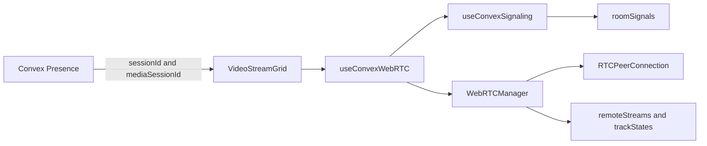

# WebRTC Hardening Plan

## Scope

Keep the existing full-mesh P2P architecture, but make the current code safer to release by removing known race and stale-state failure modes. This does not include TURN setup, LiveKit, or a provider migration.

## Target Architecture

## Implementation Steps

1. Use session-scoped peer identity

- Change WebRTC peer IDs from `userId` to per-tab `sessionId` so reloads and duplicate tabs do not share one transport identity.
- Update `[apps/web/src/components/VideoStreamGrid.tsx](apps/web/src/components/VideoStreamGrid.tsx)` to build remote peer IDs from participant `sessionId`, while keeping user IDs for display/game state.
- Pass the local `sessionId` from `[apps/web/src/contexts/PresenceContext.tsx](apps/web/src/contexts/PresenceContext.tsx)` into `useConvexWebRTC`.
- Keep UI mapping keyed enough to render by participant/user while transport maps by session.

2. Add media session generation and stale-signal rejection

- Add a client-generated `mediaSessionId` per WebRTC manager lifecycle in `[apps/web/src/hooks/useConvexWebRTC.ts](apps/web/src/hooks/useConvexWebRTC.ts)`.
- Extend `[apps/web/src/types/webrtc-signal.ts](apps/web/src/types/webrtc-signal.ts)` with `mediaSessionId` and validate it on all offer/answer/candidate signals.
- Store and forward this field through `[apps/web/src/hooks/useConvexSignaling.ts](apps/web/src/hooks/useConvexSignaling.ts)` and `[convex/signals.ts](convex/signals.ts)`.
- Ignore any signal whose `mediaSessionId` does not match the active local peer session rules, preventing old 60-second TTL rows from affecting a new join/reload.

3. Validate signal payloads on the backend

- Replace broad `payload: v.any()` handling in `[convex/signals.ts](convex/signals.ts)` with Convex validators for offer, answer, candidate, and leave payloads.
- Keep the schema table field as flexible only if required by Convex schema constraints, but validate at public mutation boundaries before insert.
- Add clear error messages for malformed or unsupported signals.

4. Remove time-dependent authorization from Convex queries

- Refactor `requireActiveRoomMember` in `[convex/signals.ts](convex/signals.ts)` so `listSignals` does not call `Date.now()` inside a query path.
- For `sendSignal`, keep active membership checks in the mutation where time-based validation is acceptable.
- For `listSignals`, check stable membership/status by indexed lookup, and rely on presence cleanup/heartbeat state elsewhere for liveness.

5. Make peer cleanup explicit

- Update `[apps/web/src/lib/webrtc/WebRTCManager.ts](apps/web/src/lib/webrtc/WebRTCManager.ts)` so replacing or closing a peer emits `onRemoteStream(peerId, null)` and clears track state for that peer.
- Ensure `closePeer`, new-offer replacement, and `destroy` all follow the same cleanup helper.
- Update `[apps/web/src/hooks/useConvexWebRTC.ts](apps/web/src/hooks/useConvexWebRTC.ts)` to remove remote stream, connection state, and track state entries when a peer closes.

6. Sequence queued ICE candidate flushing

- Change `flushPendingCandidates` in `[apps/web/src/lib/webrtc/WebRTCManager.ts](apps/web/src/lib/webrtc/WebRTCManager.ts)` from parallel fire-and-forget handling to ordered async processing.
- Await candidate application after remote description is present, report the first hard failure, and then clear only successfully processed queue entries.

7. Reduce noisy global logging and add focused diagnostics

- Gate verbose WebRTC/presence logs behind a local debug flag or helper, instead of unconditional `console.log` in production paths.
- Add a small diagnostic helper that can report peer ID, media session ID, connection state, ICE state, signaling state, and active track counts for E2E failure attachments.

8. Add focused tests before broad refactors

- Add unit tests for `signal-handlers`, stale signal rejection, server-side signal validation, and peer cleanup.
- Expand `[apps/web/tests/unit/useConvexWebRTC.helpers.test.ts](apps/web/tests/unit/useConvexWebRTC.helpers.test.ts)` for session IDs and reconnect behavior.
- Add tests around `WebRTCManager` with mocked `RTCPeerConnection` for candidate ordering, cleanup callbacks, and duplicate offer replacement.
- Keep existing Playwright torture tests as the end-to-end safety net.

## Verification

- Run targeted unit tests for WebRTC/signaling changes.
- Run `bun typecheck`.
- Run existing Playwright WebRTC suites only when auth/preview credentials are available.
- Manually verify a two-tab reload/rejoin scenario and a duplicate-session scenario because those are the core identity/stale-signal risks.
