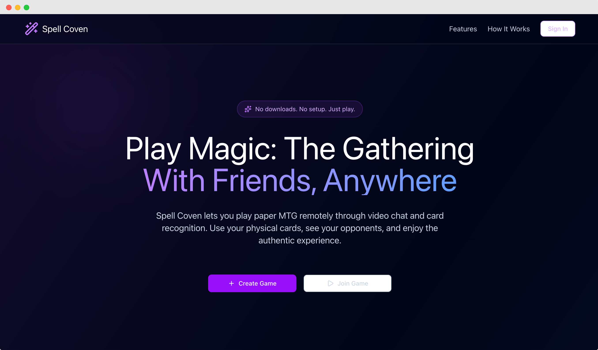

# Spell Coven - MTG Remote Play Platform

A browser-based platform for playing paper Magic: The Gathering remotely with friends. Spell Coven enables MTG players to play their physical cards online through video chat, card recognition, and game management tools—all running in your browser with no downloads required.

Production: [https://spell-coven.vercel.app](https://spell-coven.vercel.app)

## About This Project

**This is a hobby project.** I'm a full-time web developer, and Spell Coven is my playground for exploring cutting-edge AI tools and staying in the loop with what's possible in modern web development. It's a passion project born from my love of Magic: The Gathering and curiosity about emerging technologies like browser-based machine learning, WebRTC, and computer vision.

## Vision

Spell Coven aims to provide a comprehensive remote play experience for Magic: The Gathering players, competing with platforms like SpellTable by offering:

- **Multi-party Video & Voice**: Browser-based video chat optimized for overhead camera views of playmats (2-4 players per game)
- **Intelligent Card Recognition**: Computer vision powered by CLIP to identify cards in real-time and display rulings/details
- **Game Management Tools**: Life total tracking, commander damage tracking, and game timers
- **Flexible Room System**: Create or join private/public game rooms with format and power level metadata for better matchmaking
- **Device Flexibility**: Use standard webcams or mobile devices as overhead cameras without separate apps
- **Fully Browser-Based**: No installation required—works on modern browsers (Chrome, Firefox, Safari)

## Current Features

The following features are currently available and working:

- ✅ **Room System**: Create and join game rooms with real-time player presence
- ✅ **Multi-party Video/Audio Chat**: WebRTC-powered video and audio communication between players
- ✅ **Webcam Integration**: Use your webcam as an overhead camera for your playmat
- ✅ **User Authentication**: Sign in with Convex authentication
- ✅ **Life Total Tracking**: Keep track of life totals for all players
- ✅ **Commander Damage Tracking**: Track commander damage across multiple opponents
- ✅ **Invite by URL**: Share a link to invite friends to your game room

## Coming Soon

These features are actively being developed:

- 🚧 **Card Recognition**: Click-to-identify cards using CLIP-based visual search and Scryfall integration (in progress)
- 🚧 **Card Boundary Detection**: OpenCV.js for real-time card detection in video feeds (in progress)
- 🚧 **Pre-computed Embeddings**: Database of ~20k+ MTG card embeddings for fast similarity search (in progress)

## Planned Features

Future enhancements on the roadmap:

- **Public/Private Room Matchmaking**: Find games with players of similar formats and power levels
- **User Accounts and Game History**: Track your play sessions over time
- **Replay and Spectator Modes**: Watch games or review past sessions

## Target Use Case

Spell Coven is designed for Magic: The Gathering players who want to play with their physical cards remotely against friends. The platform enables:

- **Remote Play Sessions**: Play paper MTG with friends across distances using video chat
- **Casual & Competitive Play**: Support for various formats (Commander, Modern, Standard, etc.) with power level indicators
- **Card Identification**: Quickly identify cards on camera for rules lookups and oracle text (coming soon)
- **Game State Tracking**: Keep track of life totals and commander damage
- **Flexible Setup**: Use any webcam or smartphone as an overhead camera—no special equipment needed

## Quick Start

1. **Install dependencies:**

   ```sh
   bun install
   ```

2. **Start the Convex development server:**

   ```sh
   bun run convex:dev
   ```

3. **Start the Web development server:**

   ```sh
   bun run dev
   ```

4. **Open the app:**
   Navigate to https://localhost:1234 to get started.

## What's inside?

This Turborepo monorepo houses all applications and packages needed to drive the Spell Coven platform:

### Apps and Packages

- **`web`**: Main web application for remote MTG play (Vite + React + TanStack Router)
  - Room system with real-time player presence
  - WebRTC video/audio chat
  - Card recognition (in development)
- **`@repo/mtg-image-db`**: Pre-generated CLIP embeddings and metadata for MTG card database
  - Python pipeline for downloading Scryfall data
  - FAISS index builder for efficient similarity search
  - Browser-optimized export (int8 quantization)
- **`@repo/ui`**: Shared React component library
- **`@repo/eslint-config`**: Shared ESLint configurations
- **`@repo/typescript-config`**: Shared TypeScript configurations
- **`@repo/tailwind-config`**: Shared Tailwind CSS configuration
- **`@repo/prettier-config`**: Shared Prettier configuration

Each package/app is 100% [TypeScript](https://www.typescriptlang.org/) (Python for data pipeline).

### Key Technologies

**Frontend**:

- React 19, TanStack Router, Tailwind CSS
- Vite with TypeScript
- Convex for authentication

**Real-time Communication**:

- WebRTC for peer-to-peer video/audio
- Convex for real-time data sync and room management

**Card Recognition** (in development):

- CLIP (via [@huggingface/transformers](https://huggingface.co/docs/transformers.js)) for image feature extraction
- OpenCV.js for real-time card boundary detection
- FAISS for efficient similarity search

**Infrastructure**:

- Turborepo managed with Bun workspaces
- Python data pipeline with PyTorch, FAISS, Scryfall API

### Utilities

This Turborepo has some additional tools already setup for you:

- [TypeScript](https://www.typescriptlang.org/) for static type checking
- [ESLint](https://eslint.org/) for code linting
- [Prettier](https://prettier.io) for code formatting

### Build

To build all apps and packages, run the following command:

```
cd spell-coven-mono

# With [global `turbo`](https://turborepo.com/docs/getting-started/installation#global-installation) installed (recommended)
turbo build

# Without [global `turbo`](https://turborepo.com/docs/getting-started/installation#global-installation), use your package manager
bunx turbo run build
```

You can build a specific package by using a [filter](https://turborepo.com/docs/crafting-your-repository/running-tasks#using-filters):

```
# With [global `turbo`](https://turborepo.com/docs/getting-started/installation#global-installation) installed (recommended)
turbo build --filter=docs

# Without [global `turbo`](https://turborepo.com/docs/getting-started/installation#global-installation), use your package manager
bunx turbo run build --filter=docs
```

## Credits

- Mana symbol vectors sourced from [Mana & Card Icons](https://mana.andrewgioia.com/icons.html) made by [Andrew Gioia](https://andrewgioia.com/).

## Contributing

This is an open-source project and contributions are welcome! Whether you're interested in:

- Adding new features (game tools, UI improvements)
- Improving card recognition accuracy
- Optimizing performance
- Writing documentation
- Reporting bugs

Please feel free to open issues or submit pull requests.

## Useful Links

Learn more about the power of Turborepo:

- [Tasks](https://turborepo.com/docs/crafting-your-repository/running-tasks)
- [Caching](https://turborepo.com/docs/crafting-your-repository/caching)
- [Remote Caching](https://turborepo.com/docs/core-concepts/remote-caching)
- [Filtering](https://turborepo.com/docs/crafting-your-repository/running-tasks#using-filters)
- [Configuration Options](https://turborepo.com/docs/reference/configuration)
- [CLI Usage](https://turborepo.com/docs/reference/command-line-reference)
