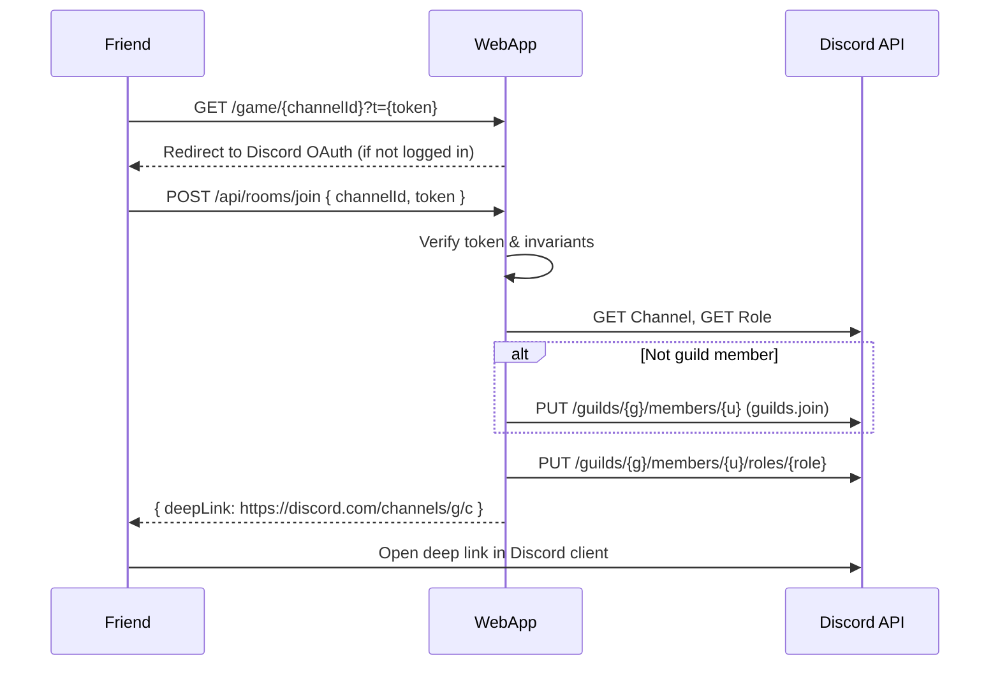

# Discord “Private Voice Room via Shareable Link” — Implementation Spec (Stateless, No DB)

**Version:** 1.0  
**Audience:** LLM/engineer implementing the backend + frontend glue  
**Goal:** The room creator joins a private voice channel (a “room”) and can share a web link `/game/{channelId}?t={token}` that lets friends authenticate and join the same voice room. No database persistence is required.

## Context / Constraints
- Web app already exists; users can authenticate with Discord using **OAuth2 + PKCE**.
- There is a server-side component (your backend) and a gateway service that can create Discord resources via bot token and announce updates to web clients over WS.
- Rooms are currently created as **Discord voice channels**. Users are redirected to `/game/{channelId}` after creation.
- **No DB**: We will not store room mappings. Instead we use **signed, expiring tokens** embedded in the shareable URL.

## High-Level Approach
- When a creator makes a room, create **(1) a temporary role** and **(2) a private voice channel** gated by that role.
- Generate a **short-lived signed token** that encodes the binding `{guild_id, channel_id, role_id, creator_id, iat, exp, constraints...}`.
- The shareable URL becomes:  
  `/game/{channelId}?t={signedToken}`
- On arrival, friends authenticate with Discord (PKCE), the backend **verifies token + invariants**, ensures guild membership (using the user OAuth token with `guilds.join`), **assigns the room role**, and returns a **Discord deep link** to open the voice channel.

## Non-Goals
- Forcing the user’s Discord client to join voice automatically (not possible via HTTP API).
- Persisting state in a DB. (We optionally allow an in-memory cache/Redis for single-use link enforcement, but the core spec remains stateless.)

---

## Entities & Terms
- **Room Role**: a per-room Discord role (e.g., `room-<shortId>`) used for gating access to the voice channel.
- **Room Voice Channel**: a Discord voice channel with permission overwrites that deny `@everyone` and allow `Room Role` (and the bot).
- **Signed Token**: a compact blob (JWT or HMAC) carried in the `t` query param. Encodes room metadata and constraints with an **expiration**.

---

## Security Model (Stateless)
- **Do not trust raw snowflake IDs from the URL.** The URL includes a channel ID for user experience, but **authorization** relies solely on the signed token fields.
- **Signed Token** must include:
  - `guild_id`
  - `channel_id`
  - `role_id`
  - `creator_id`
  - `iat` (issued-at) and **`exp` (expiration 15–60 minutes)**, tightened to expected invite window
  - Optional constraints: `max_seats`, `purpose:"voice-room"`, `v:1`, `room_name`, `recording_allowed:boolean`
  - Optional `jti` for single-use enforcement if you add a short-lived in-memory cache
- **Signature**: HMAC-SHA256 with a server-side secret. Alternatively JWT with HS256. Keep the secret only on the backend.
- **Invariants to check on join** (server-side):
  1. Token signature valid, `exp` not expired, `purpose` matches expected, `v` supported.
  2. **Channel exists** and is a **voice** channel; its permission overwrites reference the **`role_id`** in token.
  3. The **room role exists** and is **below the bot’s highest role**.
  4. The room role does **not** have dangerous global perms (`ADMINISTRATOR`, `MANAGE_GUILD`, etc.).
  5. If `max_seats` present: read voice state for the channel and ensure capacity not exceeded.
  6. Optionally: if the room is “locked”, only allow `creator_id` to authorize new joins.

---

## End-to-End Flow

### A) Room Creation (Creator)
1. **User authenticates** via OAuth2 + PKCE (you already have this).
2. Backend **creates a Room Role** in the guild.
3. Backend **creates a Voice Channel** with permission overwrites:
   - `@everyone` → deny `VIEW_CHANNEL`, `CONNECT`
   - `room_role` → allow `VIEW_CHANNEL`, `CONNECT`, `SPEAK`, `STREAM`
   - (Optional) `creator_id` → allow same as role (convenience)
4. Backend **generates Signed Token** with fields above (`exp` short, e.g., 30 minutes).
5. Backend **redirects** creator to `/game/{channelId}?t={token}` and also **displays** the shareable link for copying.
6. Creator opens **Discord deep link** (present a button): `https://discord.com/channels/{guild_id}/{channel_id}` to enter the voice room.

### B) Friend Follows the Link
1. Friend visits `/game/{channelId}?t={token}`.
2. Frontend prompts Discord sign-in (PKCE) if not already authorized.
3. Backend **verifies token** and checks invariants (see Security Model).
4. If friend is **not** a guild member, backend calls **Add Guild Member** using:
   - `PUT /guilds/{guild_id}/members/{user_id}` with body `{ "access_token": "<user_access_token_with_guilds.join>" }`
   - Authorization header: `Bot <bot_token>`
5. Backend **assigns the Room Role**:
   - `PUT /guilds/{guild_id}/members/{user_id}/roles/{role_id}`
6. Backend returns a response to client with:
   - **Deep link** to open the voice channel: `https://discord.com/channels/{guild_id}/{channel_id}`
   - Optional: “Open in Discord” button and a text note if capacity reached/room locked.

### C) Optional Private Text Thread (Coordination)
- You may also create a **private text thread** in a parent text channel for chat/resource sharing around the call.
- Voice access remains governed by the voice channel + role. The thread can be used for status, links, controls.

---

## Permissions & Overwrites

### Voice Channel — `permission_overwrites`
- For `@everyone` (id = `guild_id`):
  - **Deny**: `VIEW_CHANNEL`, `CONNECT`
- For `room_role` (id = `role_id`):
  - **Allow**: `VIEW_CHANNEL`, `CONNECT`, `SPEAK`, `STREAM`
- For `bot` (id = `bot_user_id`):
  - **Allow**: at least `VIEW_CHANNEL`, `CONNECT`; optionally `MOVE_MEMBERS`, `MUTE_MEMBERS` if desired
- For `creator_id` (optional): **Allow** same as role (convenience).

> Avoid granting the role powerful global permissions. Prefer **channel-scoped** access through overwrites.

---

## Token Format

### Example (JWT-like JSON payload)
```json
{
  "v": 1,
  "purpose": "voice-room",
  "guild_id": "123456789012345678",
  "channel_id": "234567890123456789",
  "role_id": "345678901234567890",
  "creator_id": "456789012345678901",
  "max_seats": 8,
  "iat": 1730000000,
  "exp": 1730001800
}
```

### Generation
- On room creation, sign with HS256 or HMAC-SHA256 using your server secret.
- Use URL-safe base64 (no padding) if you roll your own compact token.

### Validation (server-side join handler)
1. Decode → verify signature → check `exp` ≥ now.
2. Check `purpose:"voice-room"` and `v` against supported versions.
3. Fetch Discord channel + role → verify they exist and **channel overwrites reference `role_id`**.
4. If `max_seats`: fetch current voice states and enforce capacity.
5. Proceed to guild join (if needed) and role grant.

---

## API Calls (Discord HTTP)

> All endpoints use API v10; `Authorization: Bot <bot_token>`

- **Create Role**  
  `POST /guilds/{guild_id}/roles`  
  Body: `{ "name": "room-<shortId>" }`

- **Create Voice Channel**  
  `POST /guilds/{guild_id}/channels`  
  Body (simplified):
  ```json
  {
    "name": "room-<shortId>",
    "type": 2,
    "permission_overwrites": [
      {
        "id": "<guild_id>",
        "type": 0,
        "deny": ["VIEW_CHANNEL", "CONNECT"]
      },
      {
        "id": "<role_id>",
        "type": 0,
        "allow": ["VIEW_CHANNEL", "CONNECT", "SPEAK", "STREAM"]
      },
      {
        "id": "<bot_user_id>",
        "type": 1,
        "allow": ["VIEW_CHANNEL", "CONNECT", "SPEAK"]
      }
    ]
  }
  ```

- **Add Guild Member** (user must have authorized your app with `guilds.join`)  
  `PUT /guilds/{guild_id}/members/{user_id}`  
  Body: `{ "access_token": "<user_access_token>" }`

- **Grant Role to Member**  
  `PUT /guilds/{guild_id}/members/{user_id}/roles/{role_id}`

- **Deep Link to Channel** (open in Discord)  
  `https://discord.com/channels/{guild_id}/{channel_id}`

> Note: Invites (`POST /channels/{channel_id}/invites`) are optional; they help if users aren’t in the guild yet, but **invites do not bypass channel overwrites**. Role assignment is still required for private access.

---

## Frontend Contract

### `/game/{channelId}` Page
- If query `t` missing → show error (“Invite token required”).
- If not authenticated → trigger Discord OAuth2 PKCE → return to same URL.
- Call backend join endpoint: `POST /api/rooms/join` with `{ channelId, token: t }` (no trust in `channelId` beyond UX).

### Success Response
```json
{
  "ok": true,
  "discordDeepLink": "https://discord.com/channels/<guild_id>/<channel_id>",
  "room": {
    "name": "room-xyz",
    "seats": { "max": 8, "current": 3 }
  }
}
```
Frontend renders an **“Open in Discord”** button using `discordDeepLink`.

### Failure Modes (examples)
- `TOKEN_EXPIRED`, `TOKEN_INVALID`
- `ROOM_NOT_FOUND` (channel or role missing / mismatch)
- `ROOM_FULL` (max_seats enforced)
- `GUILD_JOIN_DENIED` (user didn’t grant `guilds.join`)
- `ROLE_ASSIGN_FAILED` (bot lacks `MANAGE_ROLES` or role position above target)

---

## Backend Handlers (Pseudocode)

### POST `/api/rooms/create` (creator)
```ts
auth.requireUser();
const shortId = nanoid(6);

// 1) Create role
const role = await discord.createRole(guildId, { name: `room-${shortId}` });

// 2) Create voice channel with overwrites
await discord.createChannel(guildId, {
  name: `room-${shortId}`,
  type: 2,
  permission_overwrites: [
    owDenyEveryone(guildId, ["VIEW_CHANNEL", "CONNECT"]),
    owAllowRole(role.id, ["VIEW_CHANNEL", "CONNECT", "SPEAK", "STREAM"]),
    owAllowUser(botUserId, ["VIEW_CHANNEL", "CONNECT", "SPEAK"])
  ]
});

// 3) Generate signed token
const token = sign({
  v: 1,
  purpose: "voice-room",
  guild_id: guildId,
  channel_id: channel.id,
  role_id: role.id,
  creator_id: user.id,
  max_seats: 8,
  iat: now(),
  exp: now() + 30*60
});

// 4) Redirect to /game/:channelId?t=token
return { redirect: `/game/${channel.id}?t=${encodeURIComponent(token)}` };
```

### POST `/api/rooms/join`
```ts
auth.requireUser(); // you have a Discord user id on session
const payload = verifyAndDecodeToken(req.body.token);

assert(payload.purpose === "voice-room");
assert(payload.exp > now());

// sanity-check Discord resources
const [channel, role] = await Promise.all([
  discord.getChannel(payload.channel_id),
  discord.getRole(payload.guild_id, payload.role_id)
]);
assert(channel.type === "voice");
assert(channelHasOverwriteForRole(channel, role.id));

// if not in guild: add via guilds.join using user's OAuth access token
if (!await discord.isMember(payload.guild_id, user.id)) {
  await discord.addGuildMember(payload.guild_id, user.id, user.oauthAccessToken);
}

// enforce capacity if specified
if (payload.max_seats) {
  const current = await discord.countVoiceMembers(channel.id);
  assert(current < payload.max_seats, "ROOM_FULL");
}

// assign role
await discord.addMemberRole(payload.guild_id, user.id, role.id);

// return deep link
return {
  ok: true,
  discordDeepLink: `https://discord.com/channels/${payload.guild_id}/${payload.channel_id}`
};
```

---

## Cleanup Strategy (Recommended)
- **Auto-clean when empty**: Gateway listens for `VOICE_STATE_UPDATE`. When the room goes from N>0 to 0 members:
  - Remove `room_role` from all recent participants (best-effort).
  - Delete voice channel.
  - Delete room role.
- **Token expiry** ensures old links stop working without DB state.
- Optional manual cleanup endpoint for the creator (validates `creator_id` from token).

---

## Edge Cases & Notes
- **Role hierarchy**: Ensure the room role is **below** your bot’s highest role; otherwise `MANAGE_ROLES` operations will fail.
- **Multiple joins**: If you want single-use invites, include `jti` and keep a short-lived in-memory set of used IDs (Redis or process memory).
- **Re-opening rooms**: Since there’s no DB, re-opening means **creating a new role + channel** and issuing a new token.
- **Guild verification level**: If the guild’s verification level is high, newly joined users might face client-side restrictions before speaking/streaming.
- **Mobile clients**: Deep links open the Discord app; consider also showing the channel name and a fallback instruction.

---

## Minimal Interface Checklist
- Backend secret for signing tokens.
- Functions (or routes) to:
  - Create role, create voice channel with overwrites.
  - Add guild member with `guilds.join` (given user access token).
  - Add role to member.
  - Fetch channel + role + voice member counts.
- Frontend:
  - `/game/{channelId}` page reads `t`, ensures login, calls `/api/rooms/join`.
  - Renders “Open in Discord” deep link button on success.

---

## Mermaid Sequence (Join)


---

## Testing Plan
- **Unit**: token signing/verification; invariant checks against mocked channel/role.
- **Integration**: full join flow with a test guild; verify permissions and inability to join without the role.
- **Negative**: expired token, wrong role in overwrites, bot missing `MANAGE_ROLES`, role hierarchy failures, room at capacity.
- **UX**: ensure deep link opens correct channel on desktop and mobile.

---

## Implementation Notes
- Use **short token lifetimes**. If creators need more time, provide a “Refresh invite” button that regenerates a token server-side.
- Present clear errors and a retry path (e.g., re-auth or ask the creator for a fresh link).
- Keep **scope minimal**: only request `identify` and `guilds.join` for the user token.

---

## Ready-to-Use Constants (example)
- Allowed perms for `room_role`: `VIEW_CHANNEL`, `CONNECT`, `SPEAK`, `STREAM`.
- Deny for `@everyone`: `VIEW_CHANNEL`, `CONNECT`.
- Token lifetime: 15–60 minutes (default 30).

---

## Deliverables
- Endpoint: `POST /api/rooms/create` → redirects creator to `/game/{channelId}?t=...`
- Endpoint: `POST /api/rooms/join` → returns deep link JSON
- Frontend page: `/game/{channelId}` (reads `t`, handles auth, calls join)

**This spec is self-contained and avoids DB persistence while remaining secure and user-friendly.**
